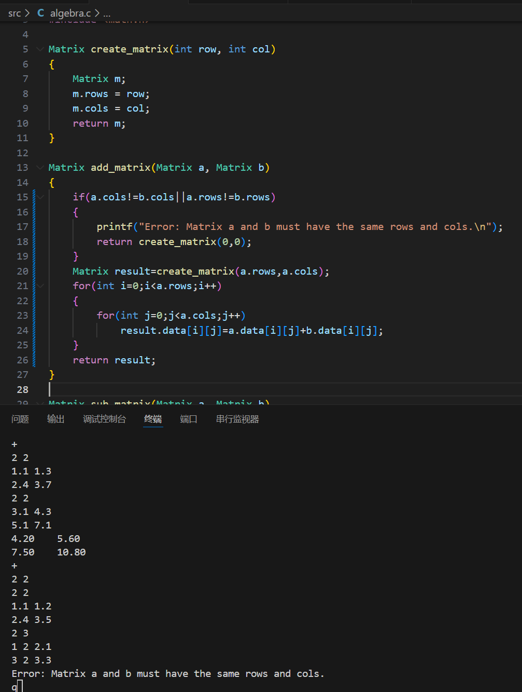
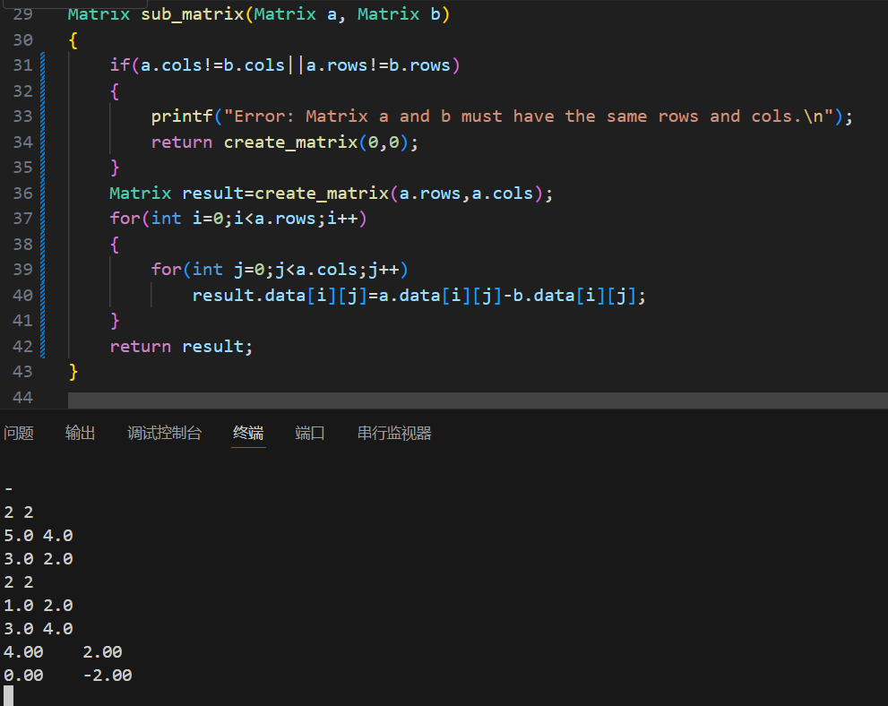
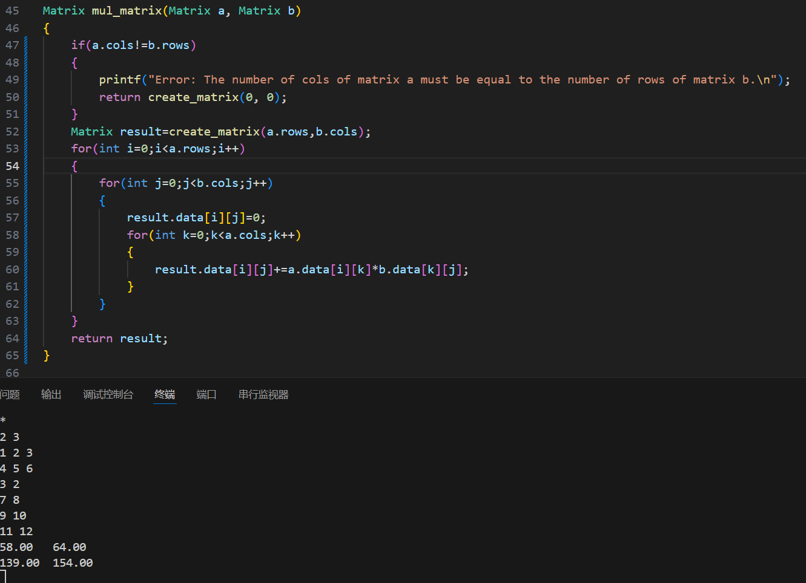
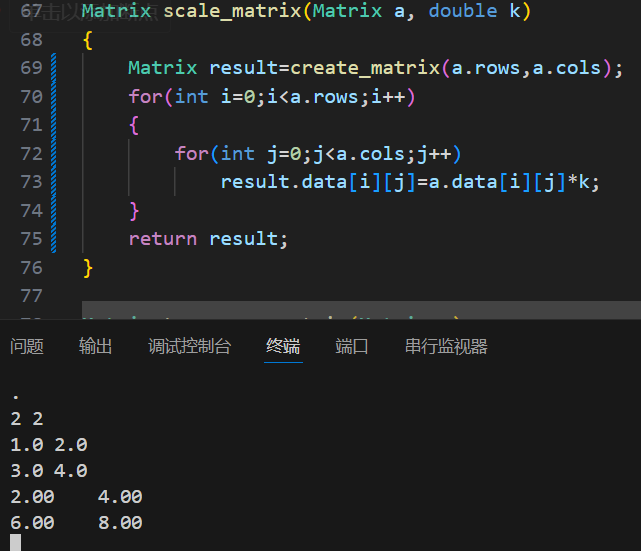
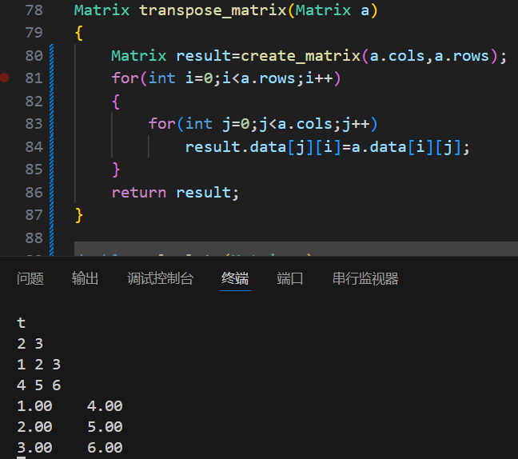
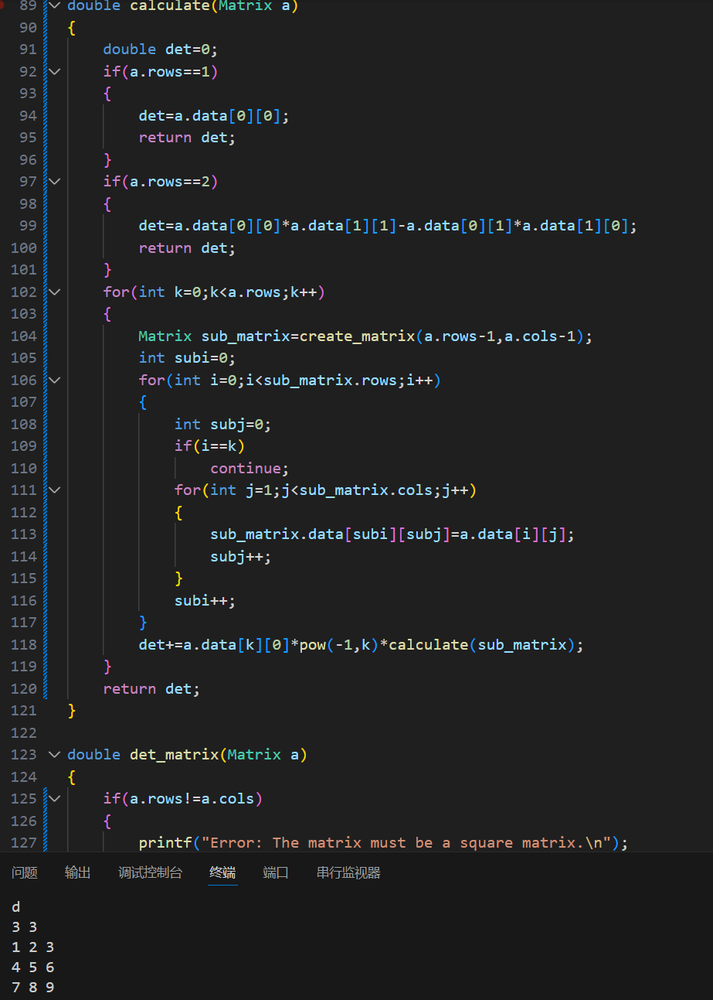
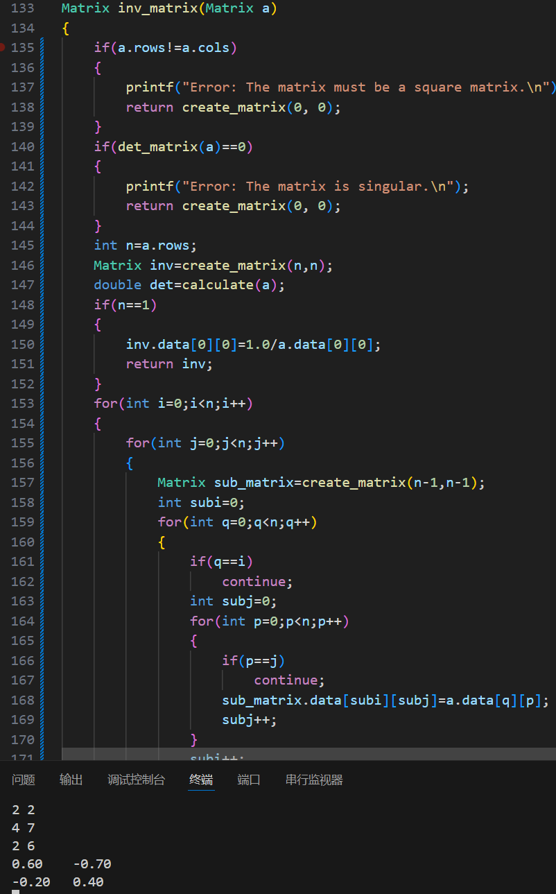
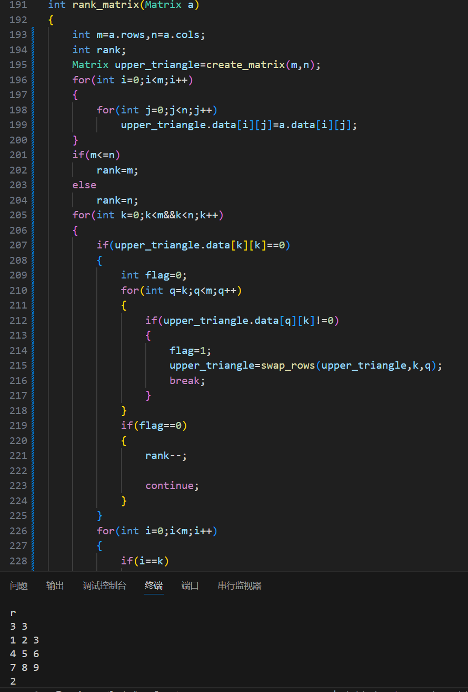
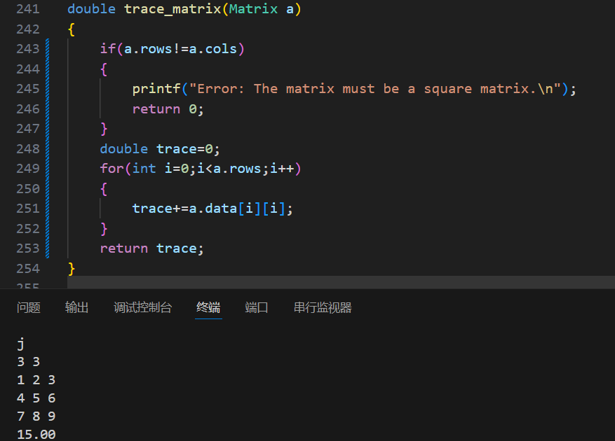

# algebra
硬件技术团队编程基础作业

# 思路
## 加法

## 减法

## 乘法

## 数乘

## 转置

## 行列式计算
另外写一个calculate函数，在其他运算中也会用到。使用递归，先讨论一阶和二阶的情况，其他情况按第一列展开。

## 求逆
每次循环算出伴随矩阵的一个元素，用calculate函数算出行列式，相除即得逆矩阵的元素。去除某行某列时的思路与前面行列式计算中的相似。

## 求秩
先判断对角线上某元素是否为零，若是，则在后面行相同列寻找不为零的数。若找到，则交换两行；若找不到，则秩减一。
在元素不为零或找到不为零元素的情况下，将这一列上的其他元素消为零。

## 求迹
对角线元素相加
